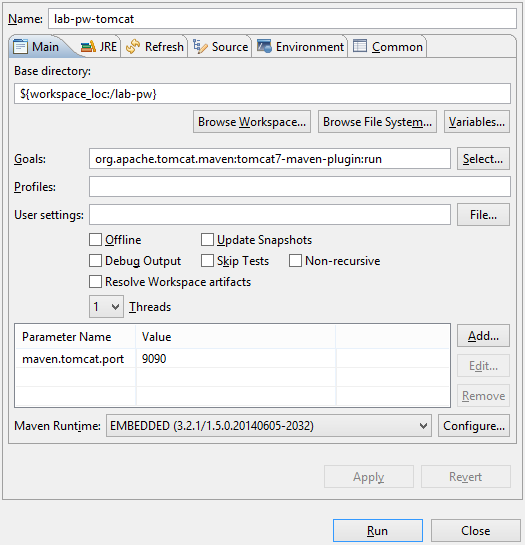

Para executar a aplicação utilize o seguinte plugin do maven:

**org.apache.tomcat.maven:tomcat7-maven-plugin:2.2:run**

Adicione o parâmetro abaixo para executar na porta 9090:

**maven.tomcat.port** = **9090**

Exemplo no Eclipse:

